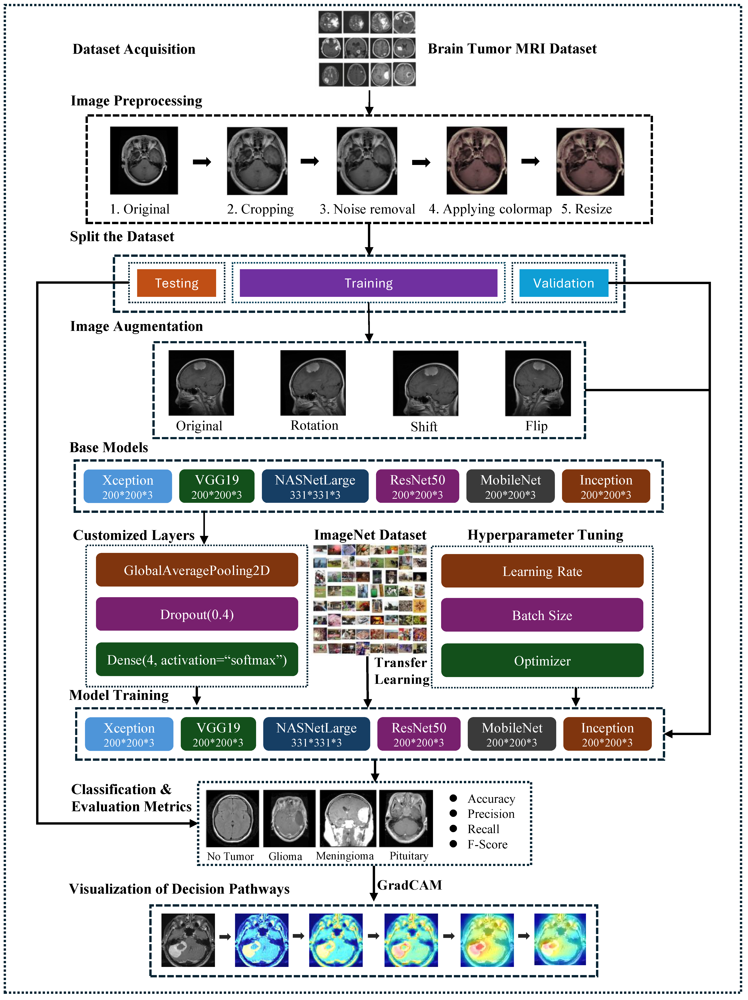
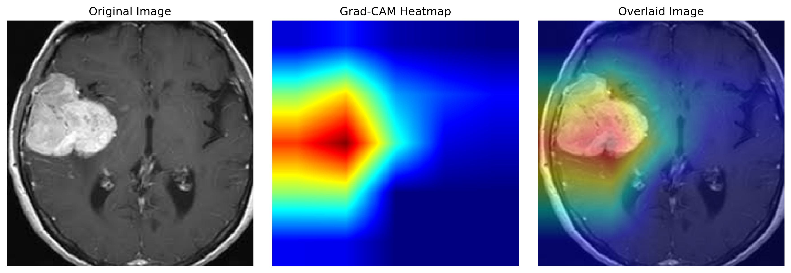

# Brain Tumor Classification using Deep Learning & Explainable AI (Grad-CAM)

## Overview

This project focuses on brain tumor classification using deep learning models and enhances interpretability using Grad-CAM (Gradient-weighted Class Activation Mapping).

The system processes MRI images, performs classification using multiple architectures, and generates visual explanations highlighting regions influencing predictions.

---

## Problem Statement

Classify brain MRI images into tumor categories and provide interpretable explanations of model predictions using Grad-CAM.

---

## Project Overview

This project builds a deep learning-based pipeline for brain tumor classification from MRI images with a focus on interpretability.

* Classifies MRI scans into four tumor categories
* Uses transfer learning with multiple CNN architectures
* Applies Grad-CAM for visual explanations
* Evaluates the impact of data augmentation on performance

---

## Dataset

This project uses the Brain Tumor MRI Dataset available on Kaggle:

https://www.kaggle.com/datasets/masoudnickparvar/brain-tumor-mri-dataset

### Dataset Details

* Contains approximately 7000+ MRI images
* Images are classified into four categories:

  * Glioma Tumor
  * Meningioma Tumor
  * Pituitary Tumor
  * No Tumor

### Data Usage

* Images were preprocessed (cropping, resizing, noise removal)
* Dataset was split into:

  * Training
  * Validation
  * Testing

### Note

The dataset is publicly available on Kaggle and is not included in this repository due to size constraints.

---

## Methodology



### Workflow

1. Image preprocessing (cropping, noise removal, resizing)
2. Dataset split (train / validation / test)
3. Data augmentation (rotation, shift, flip)
4. Model training using transfer learning
5. Evaluation using classification metrics
6. Grad-CAM visualization for interpretability

---

## Models Used

* InceptionV3
* Xception
* EfficientNet

---

## Experiments

### InceptionV3 (With Augmentation)

* Improved generalization and robustness
* Better performance on unseen data

### InceptionV3 (Without Augmentation)

* Faster convergence
* Lower generalization capability

### Grad-CAM Pipeline

* Integrated outputs from multiple models
* Generated heatmaps highlighting tumor regions

---

## Results

### Grad-CAM Example



### Evaluation Metrics

* Accuracy and loss trends
* Confusion matrix
* ROC curve
* Classification report

---

## Project Structure

```
brain-tumor-classification-gradcam/
│
├── notebooks/
│   ├── gradcam_pipeline.ipynb
│   ├── inception_with_augmentation.ipynb
│   └── inception_without_augmentation.ipynb
│
├── outputs/
│   ├── gradcam_pipeline/
│   ├── inception_with_augmentation/
│   └── inception_without_augmentation/
│
├── requirements.txt
└── README.md
```

---

## Tech Stack

* Python
* TensorFlow / Keras
* OpenCV
* NumPy, Pandas
* Matplotlib
* Scikit-learn

---

## Model Weights

Pretrained model weights (.h5 files) are not included due to size constraints.

They were used during training and inference in the Grad-CAM pipeline.

---

## How to Run

```
pip install -r requirements.txt
```

Run the notebooks to:

* Train models
* Generate predictions
* Visualize Grad-CAM outputs

---

## Research & Presentation

This project was presented at the IHCI Conference, Jaipur (2025), focusing on deep learning and explainable AI for interpretable brain tumor classification.

---

## Key Learnings

* Deep learning for medical image classification
* Impact of data augmentation on performance
* Model interpretability using Grad-CAM
* Designing multi-model pipelines

---

## Author

Aditya Singh
B.Tech CSE, LNMIIT
